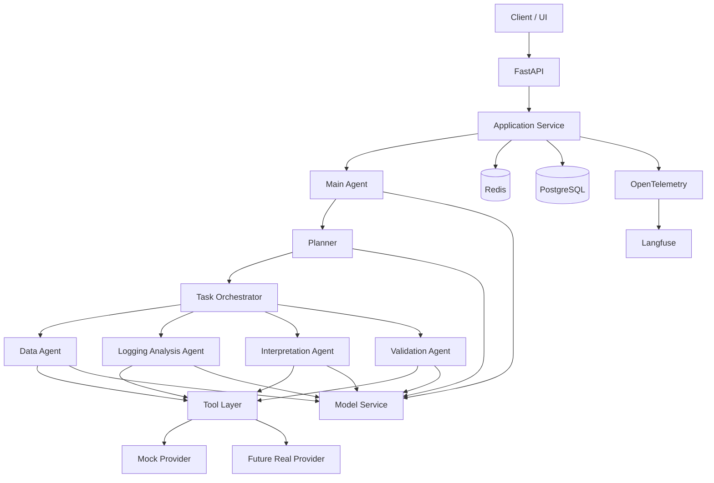
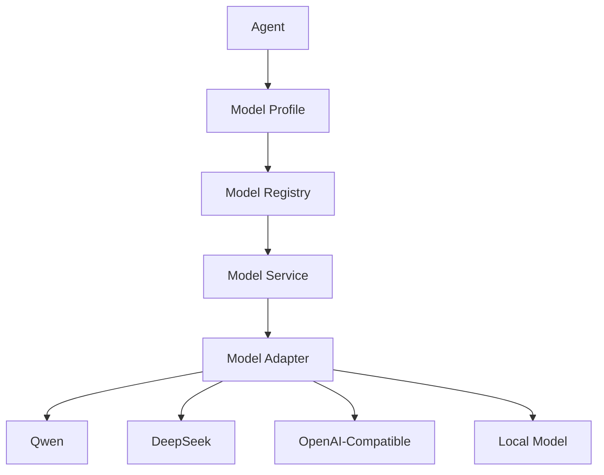

# 测井解释智能体技术架构方案

> 版本：MVP 架构版  
> 目标周期：2 周完成核心技术架构与 Agent 能力演示  
> 核心框架：AgentScope  
> 文档定位：仅描述技术架构、技术选型、核心组件与扩展设计，不展开项目管理、业务验收等非技术内容。

---

## 1. 技术目标与范围

### 1.1 建设目标

本阶段目标不是一次性建设完整生产级测井解释平台，而是在两周内完成一套：

- 可运行；
- 可演示；
- 可扩展；
- 可观测；
- 支持多 Agent 协作；
- 支持 Tool 调用；
- 支持后续横向扩展；

的测井解释智能体技术骨架。

两周后应能够完整演示：

```text
用户请求
  ↓
Main Agent 理解任务
  ↓
Planner 生成执行计划
  ↓
Task Orchestrator 编排任务
  ↓
Sub Agent 执行专业子任务
  ↓
Tool 获取数据 / 执行计算
  ↓
Agent 分析 Tool 结果
  ↓
多 Agent 协作
  ↓
Validation
  ↓
Main Agent 汇总最终解释结果
```

本阶段允许：

- 测井数据使用 Mock；
- 专业计算 Tool 使用 Mock；
- 外部系统接口使用 Mock；
- 部分知识能力使用简化实现。

但 Agent 的任务理解、规划、任务调度、Tool 选择、Tool 调用、结果分析、多 Agent 协作和结果汇总必须真实运行。

---

### 1.2 本期建设范围

本期重点建设：

1. AgentScope 基础框架集成；
2. Main Agent；
3. Planner；
4. 多类 Sub Agent；
5. Task Orchestrator；
6. Tool Registry 与 Tool 执行体系；
7. Model Registry 与 Model Profile；
8. Context / State 管理；
9. PostgreSQL 持久化；
10. Redis 运行时状态存储；
11. Prompt 管理；
12. Mock 数据和 Mock Tool；
13. OpenTelemetry Trace；
14. Langfuse Agent 可观测；
15. Docker / Docker Compose 本地环境；
16. pytest 自动化测试。

---

### 1.3 本期暂不重点建设

以下能力保留扩展位置，但不在两周 MVP 中做完整实现：

- Kubernetes；
- 生产级高可用；
- MQ 分布式任务队列；
- 完整 RBAC 权限体系；
- 全面安全体系；
- 大规模性能容量规划；
- 生产级向量数据库；
- 完整 CI/CD；
- 自动扩缩容；
- 模型动态负载均衡；
- 智能模型路由；
- 完整长期 Memory。

---

## 2. 技术设计原则

### 2.1 高内聚、低耦合

Agent、Tool、模型、状态存储、数据库、Workflow 不直接绑定具体实现。

核心原则：

```text
业务层依赖抽象接口
        ↓
基础设施提供具体实现
```

---

### 2.2 Agent 服务尽可能无状态

Agent 进程内部不长期保存：

- Session；
- Context；
- Task State；
- Workflow State；
- Agent 执行状态。

共享状态优先存储于：

```text
Redis
+
PostgreSQL
```

从而支持未来多个 Agent Service 实例横向扩展。

---

### 2.3 接口优先

核心模块先定义接口，再提供实现：

```text
ContextStore
├── RedisContextStore
└── InMemoryContextStore

TaskRepository
├── PostgreSQLTaskRepository
└── InMemoryTaskRepository

TaskExecutor
├── LocalTaskExecutor
└── FutureDistributedTaskExecutor

KnowledgeRetriever
├── MockRetriever
└── FutureVectorRetriever
```

---

### 2.4 Mock 可替换

Agent 不应该感知数据来自：

- Mock JSON；
- PostgreSQL；
- 真实测井数据库；
- 外部 API。

例如：

```text
Agent
  ↓
WellDataTool
  ↓
Data Provider Interface
  ├── Mock Provider
  └── Real Provider
```

---

### 2.5 模型与 Agent 职责解耦

Agent 不直接绑定具体模型。

统一采用：

```text
Agent
  ↓
Model Profile
  ↓
Model Registry
  ↓
Model Adapter
  ↓
具体模型
```

未来切换模型无需修改 Agent 业务代码。

---

### 2.6 可观测优先

每一次完整任务都必须能够追踪：

- 用户请求；
- Main Agent；
- Planner；
- Task；
- Sub Agent；
- LLM Call；
- Tool Call；
- 输入；
- 输出；
- Token；
- 耗时；
- 异常；
- 最终结果。

---

## 3. 技术栈与技术选型

| 技术领域 | 技术选型 | 本期状态 | 说明 |
|---|---|---:|---|
| 开发语言 | Python 3.11+ | 必须 | Agent 主体开发语言 |
| Agent 框架 | AgentScope | 必须 | Agent、消息、模型、Tool、多 Agent 基础能力 |
| API 框架 | FastAPI | 必须 | 对外 REST API |
| ASGI Server | Uvicorn | 必须 | FastAPI 运行时 |
| 数据模型 | Pydantic | 必须 | API、Task、Tool、Agent 输入输出校验 |
| ORM | SQLAlchemy | 必须 | PostgreSQL 访问抽象 |
| 数据库 | PostgreSQL | 必须 | 持久化业务和执行数据 |
| DB Migration | Alembic | 必须 | 数据库版本管理 |
| Runtime State | Redis | 必须 | Session、Context、Task State、缓存 |
| Redis Client | redis-py | 必须 | Redis 访问 |
| Agent 编排 | AgentScope Pipeline / Routing | 必须 | Agent 调用与基础编排 |
| 任务编排 | 自定义轻量 Task Orchestrator | 必须 | Plan 到 Task 的执行管理 |
| Tool 体系 | AgentScope Tool + 业务 Tool 封装 | 必须 | Tool 注册、调用、校验与扩展 |
| 模型管理 | Model Registry + Model Profile | 必须 | 多模型与角色映射 |
| 异步能力 | asyncio | 必须 | Agent、Tool 并发执行 |
| HTTP Client | httpx | 必须 | 外部 API 调用 |
| Prompt 管理 | YAML / Markdown + Loader | 必须 | Prompt 配置化与版本化 |
| 日志 | structlog / 标准 logging | 必须 | 结构化应用日志 |
| Trace 标准 | OpenTelemetry | 必须 | 分布式 Trace 标准 |
| Agent 可观测 | Langfuse | 必须 | LLM / Agent / Tool Trace 展示 |
| 测试 | pytest | 必须 | 单元、集成、流程测试 |
| Mock | JSON + Mock Tool | 必须 | 测井数据与工具模拟 |
| 包管理 | uv | 推荐 | Python 依赖和环境管理 |
| 容器 | Docker | 推荐 | 应用容器化 |
| 本地环境 | Docker Compose | 推荐 | PostgreSQL、Redis、Langfuse、Agent 服务 |
| RAG | 预留接口 | 可选 | 专业知识检索 |
| Vector DB | 后续选择 | 暂缓 | RAG 生产化能力 |
| MQ | 预留 Executor 接口 | 暂缓 | 分布式任务执行 |
| Kubernetes | 后续 | 暂缓 | 生产部署与扩缩容 |
| CI/CD | 后续 | 暂缓 | 自动测试、构建、发布 |

---

## 4. 总体技术架构

### 4.1 总体架构



---

### 4.2 核心分层

```text
API Layer
    ↓
Application Layer
    ↓
Agent / Domain Layer
    ↓
Task Orchestration Layer
    ↓
Tool / Model / Context Abstraction
    ↓
Infrastructure Layer
    ↓
PostgreSQL / Redis / LLM / External APIs
```

---

### 4.3 AgentScope 的定位

AgentScope 是系统的 Agent Runtime 和 Agent 能力基础框架，但不是整个业务系统本身。

推荐结构：

```text
Application
    ↓
Agent Domain Interface
    ↓
AgentScope Adapter
    ↓
AgentScope
```

业务模块尽量避免大面积直接依赖 AgentScope 内部实现。

---

## 5. Agent 架构设计

### 5.1 Agent 类型

第一阶段建议保留以下 Agent：

```text
Main Agent
Planner
Data Agent
Logging Analysis Agent
Interpretation Agent
Validation Agent
```

Agent 类型可以根据实际测井流程进一步调整，但角色边界需要清晰。

---

### 5.2 Main Agent

职责：

- 接收用户请求；
- 理解整体任务；
- 判断是否需要规划；
- 调用 Planner；
- 启动 Task Orchestrator；
- 获取执行结果；
- 汇总最终答案；
- 处理用户连续对话。

Main Agent 不承担大量专业 Tool 计算。

---

### 5.3 Planner

职责：

- 将复杂任务拆解成 Task；
- 定义 Task 依赖；
- 指定建议执行 Agent；
- 标记可并行任务；
- 输出结构化 Plan。

示例：

```json
{
  "tasks": [
    {
      "id": "T1",
      "type": "load_well_data",
      "agent": "data_agent",
      "depends_on": []
    },
    {
      "id": "T2",
      "type": "quality_check",
      "agent": "data_agent",
      "depends_on": ["T1"]
    },
    {
      "id": "T3",
      "type": "curve_analysis",
      "agent": "logging_analysis_agent",
      "depends_on": ["T2"]
    },
    {
      "id": "T4",
      "type": "interpretation",
      "agent": "interpretation_agent",
      "depends_on": ["T3"]
    }
  ]
}
```

---

### 5.4 Sub Agent

Sub Agent 负责具体专业子任务。

原则：

- 单一职责；
- 输入结构化；
- 输出结构化；
- Tool 范围受控；
- Model Profile 可配置；
- 不直接维护全局 Workflow 状态。

---

## 6. 任务编排与执行设计

### 6.1 Task Orchestrator 定位

Task Orchestrator 不是业务流程中的某一步，而是负责执行整个 Plan 的任务编排层。

职责：

- 读取 Plan；
- 判断依赖；
- 调用对应 Agent；
- 支持串行；
- 支持有限并行；
- 保存任务状态；
- 传递 Task Result；
- 处理失败；
- 触发后续 Task。

---

### 6.2 Task Orchestrator 与 AgentScope

推荐：

```text
Task Orchestrator
        ↓
AgentScope Pipeline / Routing
        ↓
Agent
```

AgentScope 负责 Agent 调用机制。

Task Orchestrator 负责业务任务状态和执行规则。

---

### 6.3 Task Executor 抽象

```text
Task Orchestrator
        ↓
TaskExecutor Interface
        ↓
LocalTaskExecutor      ← 本期
DistributedExecutor    ← 后续 MQ
```

本期不引入 MQ，但提前保留 TaskExecutor 抽象。

---

### 6.4 Task 状态

建议最小状态：

```text
PENDING
READY
RUNNING
SUCCESS
FAILED
SKIPPED
```

---

## 7. Tool 体系设计

### 7.1 总体结构

```text
Agent
  ↓
Tool Registry
  ↓
Tool Schema Validation
  ↓
Tool Executor
  ↓
Tool Implementation
  ↓
Mock / Real Provider
```

---

### 7.2 Tool 统一接口

Tool 至少包含：

- name；
- description；
- input schema；
- output schema；
- allowed agents；
- timeout；
- execution method。

---

### 7.3 第一阶段建议 Mock Tool

```text
get_well_data
get_curve_data
check_data_quality
get_formation_info
calculate_porosity
calculate_saturation
analyze_curve_feature
get_interpretation_rule
```

Tool 数量不宜过多，应优先覆盖完整演示链路。

---

### 7.4 Tool 权限

本期不建设完整 RBAC，但必须具备 Agent Tool 白名单：

```text
Data Agent
  → 数据类 Tool

Logging Analysis Agent
  → 曲线分析、参数计算类 Tool

Interpretation Agent
  → 解释规则类 Tool
```

---

## 8. 模型访问层设计

### 8.1 设计目标

支持：

- 当前只有一个模型；
- Main Agent / Planner 使用主模型；
- Sub Agent 未来使用轻量模型；
- Interpretation Agent 可独立使用推理模型；
- Validator 可使用低成本模型；
- 后续支持多个模型供应商。

---

### 8.2 模型架构



---

### 8.3 Model Profile

建议按角色配置：

```text
planning
reasoning
executor
validator
```

例如：

```yaml
model_profiles:
  planning:
    provider: qwen
    model: primary-model

  reasoning:
    provider: qwen
    model: primary-model

  executor:
    provider: qwen
    model: primary-model

  validator:
    provider: qwen
    model: primary-model
```

当前可以全部指向同一个模型。

未来可调整：

```yaml
planning:
  model: strong-model

executor:
  model: light-model

reasoning:
  model: strong-reasoning-model

validator:
  model: light-model
```

Agent 代码无需修改。

---

### 8.4 本期实现

本期实现：

- Model Registry；
- Model Profile；
- Agent → Profile 映射；
- 统一 Model Adapter；
- 基础调用日志。

后续扩展：

- 动态模型路由；
- Model Fallback；
- 成本路由；
- 负载均衡；
- 多模型评测。

---

## 9. Context 与 State 设计

### 9.1 状态类型

区分：

```text
Conversation Context
Session Context
Task Context
Agent Context
Workflow / Task State
```

---

### 9.2 Redis 职责

Redis 负责短生命周期、运行时共享状态：

```text
Session Context
Task Runtime State
Workflow State
Short-term Context
Cache
Distributed Lock
```

---

### 9.3 Key 规范示例

```text
session:{session_id}
task:{task_id}:state
task:{task_id}:context
workflow:{workflow_id}:state
agent:{agent_id}:runtime:{task_id}
```

---

### 9.4 TTL 策略

建议：

- Session：按业务会话周期；
- Task Runtime：任务完成后保留一定时间；
- Cache：按数据特点；
- 临时 Agent Context：短 TTL。

持久化结果写入 PostgreSQL。

---

## 10. PostgreSQL 数据设计

### 10.1 PostgreSQL 职责

负责长期保存和可追溯数据：

```text
Session
Conversation
Task
Workflow Execution
Agent Execution
Tool Execution
Interpretation Result
Prompt Version
Model Call Metadata
Evaluation Result
```

---

### 10.2 推荐核心实体

```text
sessions
conversations
tasks
workflow_executions
agent_executions
tool_executions
interpretation_results
prompt_versions
model_call_records
evaluation_results
```

---

### 10.3 Repository 模式

上层不直接依赖 SQLAlchemy。

```text
Service / Agent
      ↓
Repository Interface
      ↓
PostgreSQL Repository
```

测试可替换为：

```text
InMemory Repository
```

---

### 10.4 数据追踪关系

需要能够追踪：

```text
Session
  ↓
Task
  ↓
Workflow Execution
  ↓
Agent Execution
  ↓
Tool Execution / Model Call
  ↓
Interpretation Result
```

---

## 11. Prompt 管理

Prompt 不直接大面积硬编码在 Agent 类内部。

建议目录：

```text
prompts/
├── main_agent.md
├── planner.md
├── data_agent.md
├── logging_analysis_agent.md
├── interpretation_agent.md
└── validation_agent.md
```

每个 Prompt 建议记录：

- role；
- version；
- description；
- input variables；
- output schema；
- constraints。

---

## 12. Mock 体系

### 12.1 Mock 目标

Mock 用于替代：

- 真实井数据；
- 测井曲线；
- 地层数据；
- 专业计算服务；
- 外部业务接口。

但不能 Mock：

- Agent 任务理解；
- Planner；
- Tool 选择；
- Agent 协作；
- Task Orchestration；
- LLM 推理结果处理。

---

### 12.2 Mock 目录

```text
mocks/
├── wells/
├── curves/
├── formations/
├── interpretation_rules/
└── tools/
```

---

## 13. 日志与 Trace

### 13.1 技术选型

```text
结构化日志：
structlog / Python logging

Trace：
OpenTelemetry

Agent / LLM Observability：
Langfuse
```

---

### 13.2 Trace 层级

一次请求建议形成：

```text
request
├── main_agent
├── planner
├── task_orchestrator
│   ├── task_1
│   │   ├── sub_agent
│   │   └── tool_call
│   ├── task_2
│   │   ├── llm_call
│   │   └── tool_call
│   └── task_n
└── final_response
```

---

### 13.3 必须记录的信息

- trace_id；
- session_id；
- task_id；
- agent_name；
- model_name；
- prompt version；
- tool name；
- input；
- output；
- token usage；
- latency；
- status；
- exception。

敏感内容是否完整写入日志需通过配置控制。

---

## 14. 异常与容错

本期只实现基础容错。

### 14.1 模型调用失败

```text
Model Error
  ↓
有限次数 Retry
  ↓
失败记录
  ↓
Task Failed / 返回可理解错误
```

---

### 14.2 Tool 调用失败

支持：

- 参数错误；
- 无数据；
- Timeout；
- Tool 内部异常。

由 Tool Executor 统一转换为结构化 Tool Result。

---

### 14.3 Agent 执行失败

Agent 失败不直接导致整个系统崩溃。

Task Orchestrator 应获取结构化失败状态并决定：

- Retry；
- Skip；
- Stop；
- 由 Main Agent 重新规划。

本期可以先实现最简单策略。

---

## 15. 工程目录建议

```text
src/
├── api/
│   ├── routes/
│   └── schemas/
│
├── application/
│   ├── services/
│   └── use_cases/
│
├── agents/
│   ├── base/
│   ├── main_agent/
│   ├── planner/
│   ├── data_agent/
│   ├── logging_analysis_agent/
│   ├── interpretation_agent/
│   └── validation_agent/
│
├── orchestration/
│   ├── task_orchestrator.py
│   ├── task_executor.py
│   └── state_machine.py
│
├── tools/
│   ├── base/
│   ├── registry.py
│   ├── executor.py
│   └── logging/
│
├── models/
│   ├── registry.py
│   ├── profiles.py
│   └── adapters/
│
├── context/
│   ├── interfaces.py
│   ├── redis_store.py
│   └── memory_store.py
│
├── repositories/
│   ├── interfaces/
│   └── postgres/
│
├── infrastructure/
│   ├── database/
│   ├── redis/
│   ├── observability/
│   └── llm/
│
├── prompts/
├── mocks/
├── evaluation/
├── config/
└── common/

tests/
├── unit/
├── integration/
├── workflow/
└── scenarios/
```

---

## 16. 横向扩展设计

### 16.1 Agent Service 横向扩展

设计目标：

```text
                 Load Balancer
                     │
        ┌────────────┼────────────┐
        ▼            ▼            ▼
   Agent Svc 1   Agent Svc 2   Agent Svc 3
        │            │            │
        └────────────┼────────────┘
                     ▼
              Redis / PostgreSQL
```

Agent Service 不依赖本地长期状态，从而可以增加实例。

---

### 16.2 后续 MQ 扩展

当前：

```text
Task Orchestrator
  ↓
LocalTaskExecutor
  ↓
Agent
```

未来：

```text
Task Orchestrator
  ↓
DistributedTaskExecutor
  ↓
MQ
  ↓
Agent Worker
```

上层接口不变。

---

### 16.3 RAG 扩展

当前：

```text
KnowledgeRetriever Interface
  ↓
Mock / Local Retriever
```

未来：

```text
KnowledgeRetriever
  ↓
Embedding
  ↓
Vector DB
```

---

### 16.4 模型扩展

当前多个 Profile 可映射到同一模型。

未来可按：

- Agent Role；
- 任务复杂度；
- 成本；
- 延迟；
- 模型能力；

选择不同模型。

---

## 17. 两周 MVP 的技术完成标准

技术架构完成不以代码量为标准。

必须至少具备：

```text
用户复杂请求
    ↓
Main Agent
    ↓
Planner
    ↓
结构化 Plan
    ↓
Task Orchestrator
    ↓
多个 Sub Agent
    ↓
多个 Tool
    ↓
共享 Context / State
    ↓
结果校验
    ↓
最终输出
```

同时要求：

- PostgreSQL 可记录核心执行链；
- Redis 可保存运行时状态；
- Agent Service 不依赖单实例内存状态；
- 模型 Profile 可配置；
- Tool 可替换 Mock / Real；
- Trace 可在 Langfuse 查看；
- 至少具备一条完整 Demo 链路；
- 具备基础自动化测试。

---

## 18. 本阶段关键技术决策总结

| 决策 | 选择 |
|---|---|
| Agent 框架 | AgentScope |
| Agent 架构 | Main + Planner + 多 Sub Agent |
| 任务执行 | Task Orchestrator |
| Task Executor | 本期 Local，后续可 MQ |
| 数据持久化 | PostgreSQL |
| 运行状态 | Redis |
| Agent 横向扩展 | 无状态 Agent Service + Redis/PostgreSQL |
| Tool | Registry + Executor + Schema |
| 数据 | 本期 Mock，接口可替换 |
| 模型 | Model Registry + Model Profile |
| 主模型职责 | Main / Planner / 强推理 |
| 子 Agent 模型 | 当前可同模型，未来轻量模型 |
| 日志 | structlog / logging |
| Trace | OpenTelemetry |
| Agent 可观测 | Langfuse |
| 部署 | Docker / Docker Compose |
| RAG | 预留 |
| MQ | 预留 |
| K8s | 后续 |

---

## 19. 后续演进方向

MVP 完成后建议按以下顺序推进：

```text
真实测井数据接入
    ↓
真实 Tool 替换 Mock
    ↓
专业规则和知识库
    ↓
Agent 能力评估
    ↓
模型分层
    ↓
RAG
    ↓
分布式 Task Executor / MQ
    ↓
性能与容量优化
    ↓
权限与安全体系
    ↓
K8s / 高可用
```
